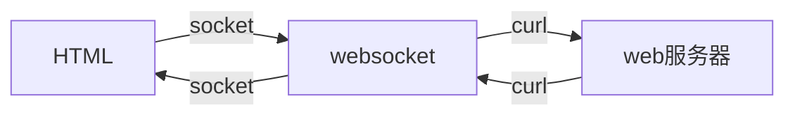

## 本文实现windows版gateway-worker请求转发

> 基于thinkphp及gateway-worker实现

## 目录结构

初始的目录结构如下：

~~~
www  WEB部署目录（或者子目录）
├─application                       应用目录
│  ├─common                         公共模块目录（可以更改）
│  ├─websocket                      websocket模块目录
│  │  ├─controller                  控制器目录
│  │  │  ├─Events.php               websocket转发控制器
│  │  │  ├─start_businessworker.php 
│  │  │  ├─start_gateway.php
│  │  │  ├─start_register.php
~~~

## 工作流程



## 使用方法

- composer安装getway-worker for win
~~~
composer require workerman/gateway-worker-for-win
~~~
- 修改`start_businessworker.php,start_gateway.php,start_register.php`三个文件中的端口/ip/域名等
- 修改`Events.php`中的$apiUrl地址
- 切换到`/application/websocket/controller`目录下执行`php start_businessworker.php start_gateway.php start_register.php`启动workerman服务
- ws请求规范
```json
  {
   "action": "replyWelcome",//curl的方法名，replyWelcome为握手
   "openid": "2",//uid绑定用
   "controller": "index"//curl控制器名
   }
```
- curl返回数据规范
```json
  {
   "data": {},//返回数据
   "sendObj": "广播对象",//myself自己allObj所有人openidObj UID集合
   "openidArr": []//UID集合
   }
```